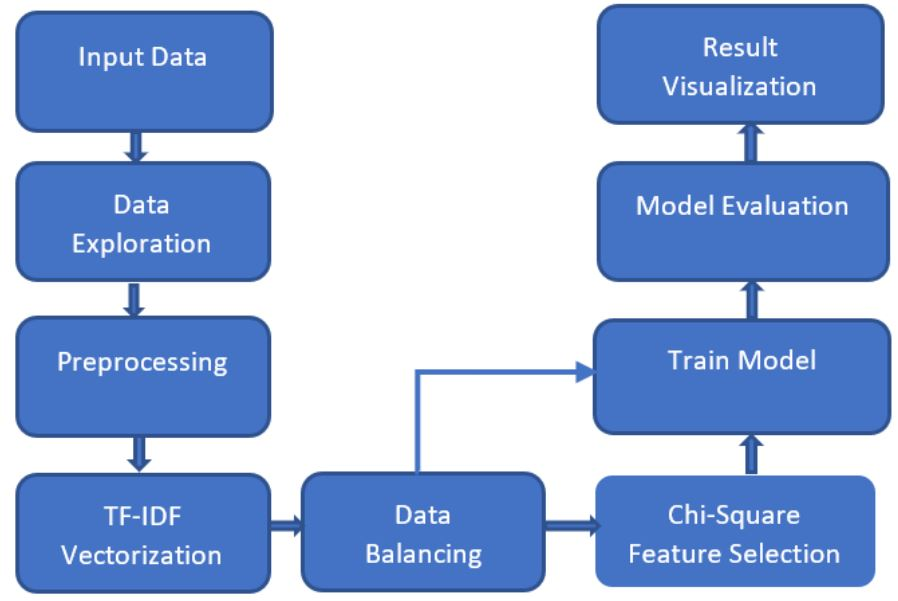

# Analyzing Sentiment of Product Reviews (v 1.0)


User reviews surely play an important role for making decisions for customers whether to buy the product or not which impacts the overall sale of the of business. Owners of those platforms can analyze this review to improve their products. Here I proposed an approach which will help to do sentiment analysis of amazon product reviews. I used TF-ID features extraction technique to get the features from the text data. For classification I used Naıve bayes, KNN, Linear SVC and XGBoost classifier. To reduce the computation time and memory I used the chi-square feature selection technique which helped to reduce the computation time significantly.


    

## Table of Contents

1. [Manifest](#manifest)
2. [Project Architectural Overview](#project-architectural-overview)
3. [Installation Instruction](#installation-instruction)
4. [Roadmap](#roadmap)
5. [Project Status](#project-status)
6. [How to contribute](#how-to-contribute)
7. [License](#license)
8. [Contact](#contact)
8. [Acknowledgements](#acknowledgements)


## Manifest

Here are list of top files from this project

```
- /src/preporcessing.ipynb --> This file is responsible for preprocessing the dataset
- /src/classification.ipynb --> This file does the job for classification
- /src/data --> Here you can keep the dataset after downloading (Follow Installation Instruction)
- img ----------> folder contains images for the readme
```

## Project Architectural Overview


## Installation Instruction
To run the program follow below instructions.

- Download the dataset and place csv files into `src/data` directory. [Download Dataset](https://www.kaggle.com/datafiniti/consumer-reviews-of-amazon-products/download)
- After downloading the whole dataset you will find 3 csv files. Set path of those files to the following variables located in this file [preporcessing.ipynb](src/preporcessing.ipynb)


```python
data1_path = 'data/1429_1.csv'
data2_path = 'data/Datafiniti_Amazon_Consumer_Reviews_of_Amazon_Products_May19.csv'
data3_path = 'data/Datafiniti_Amazon_Consumer_Reviews_of_Amazon_Products.csv'
```
- Run all the cells of this file [preporcessing.ipynb](src/preporcessing.ipynb)
This will export a csv file named `preprocessed-dataset.csv` in the base directory after doing necessary preprocessing. Preprocessing steps includes
    - Data Cleaning
    - Removing Link
    - Remove Tags
    - Removing Stop Word
    - Stemming

- Then run all the cell of this file [classification.ipynb](src/classification.ipynb)
This will use the preprocessed data from `preprocessed-dataset.csv` for further processing
    - It will vectorize the data using TF-IDF
    - It will oversample the dataset to balance the dataset
    - Split the whole dataset in 80:20 ratio which will be used for Training and Testing
    - It will use GridSearch with 5-Fold Cross validation to fine tune the hyperparameters of the classifiers
    - At last it will evaluate the model with Test dataset and print the Training Time, Accuray, Precision, Recall & F1-Score in output cells


## Roadmap
There are few things i would like to address in future.
- I shall perform cross domain testing on this trained model
- I shall train model with large number of reviews data from various categories of product
- I have desire to do the Sentiment Analysis using Deep Learning techniques (e.g. CNN, LSTM)

If you have other cool ideas regarding this, let me know also.

## Project Status
I am still working on this to improve the model. I am following the [Roadmap](#roadmap) mentioned above

## How to contribute
 Any kind of feedback on this is really appritiated. I shall be more than happy to have any pull request from smart people like you.
 

## License
This project is distributed under the MIT License. See [LICENSE](LICENSE.md) file for more information.

## Contact
For any kind of help, support or suggestions feel free to knock me. <a href = "mailto: mali23@lakeheadu.ca">Send Email</a>


## Acknowledgements
Till now i am the only person who contributed to this project. If you are interested to join. Fell free to knock me. <a href = "mailto: mali23@lakeheadu.ca">Email</a>

Here are few resources which i followed while developing this project.

01. https://machinelearningmastery.com/develop-first-xgboost-model-python-scikit-learn/

02. https://towardsdatascience.com/support-vector-machine-introduction-to-machine-learning-algorithms-934a444fca47

03. https://towardsdatascience.com/chi-square-test-for-feature-selection-in-machine-learning-206b1f0b8223#:~:text=In%20feature%20selection%2C%20we%20aim,hypothesis%20of%20independence%20is%20incorrect.

04. https://www.geeksforgeeks.org/ml-chi-square-test-for-feature-selection/

05. https://towardsdatascience.com/using-the-chi-squared-test-for-feature-selection-with-implementation-b15a4dad93f1

06. https://www.kaggle.com/datafiniti/consumer-reviews-of-amazon-products

07. https://medium.com/analytics-vidhya/features-selection-in-machine-learning-model-building-f938de5e4e68

08. https://scikit-learn.org/stable/modules/grid_search.html

09. https://machinelearningmastery.com/k-fold-cross-validation/#:~:text=Cross%2Dvalidation%20is%20a%20resampling,k%2Dfold%20cross%2Dvalidation.

10. https://www.analyticsvidhya.com/blog/2020/10/how-to-choose-evaluation-metrics-for-classification-model/
